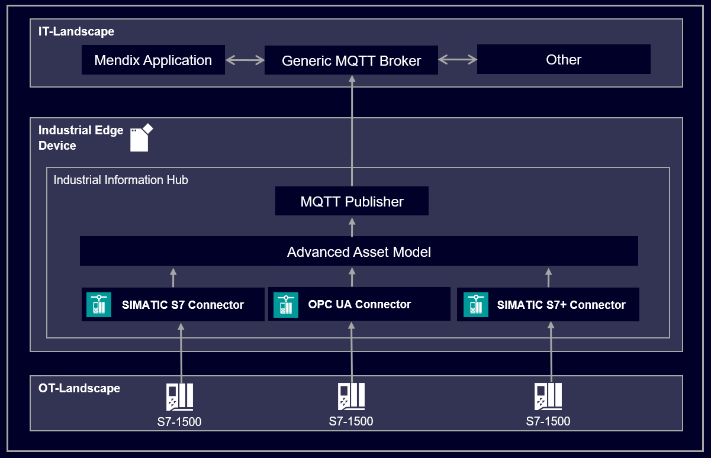
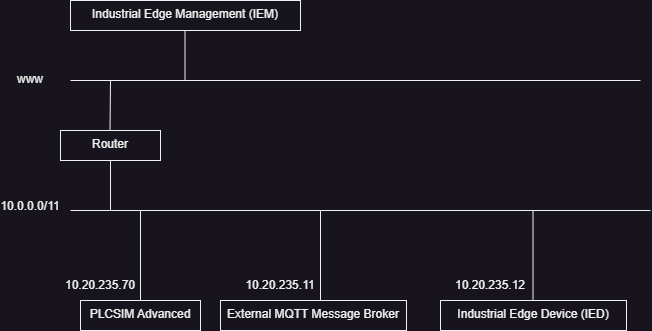
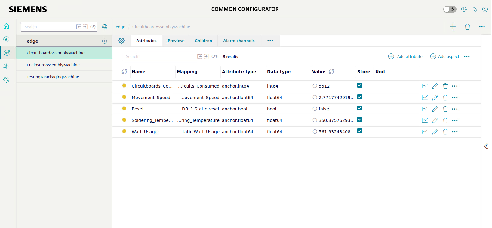
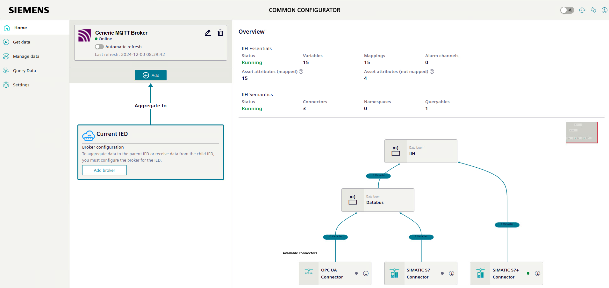

# Unified Namespace with Industrial Information Hub

- [Unified Namespace with Industrial Information Hub](#unified-namespace-with-industrial-information-hub)
  - [Description](#description)
    - [Overview](#overview)
    - [General Task](#general-task)
  - [Requirements](#requirements)
    - [Prerequisites](#prerequisites)
    - [Network Topology](#network-topology)
  - [Installation](#installation)
    - [Setup PLC Simulation](#setup-plc-simulation)
    - [IED: Configure Data Aquisition](#ied-configure-data-aquisition)
      - [OPC UA Connector](#opc-ua-connector)
        - [Alternative: Manual Configuration](#alternative-manual-configuration)
      - [S7+ Connector](#s7-connector)
        - [Alternative: Manual Configuration](#alternative-manual-configuration-1)
      - [S7 Connector](#s7-connector-1)
        - [Alternative: Manual Configuration](#alternative-manual-configuration-2)
    - [Create Contextualized Model: Advanced Asset Model](#create-contextualized-model-advanced-asset-model)
    - [Connect the External MQTT Broker with the IIH](#connect-the-external-mqtt-broker-with-the-iih)
  - [Connect to the Unified Namespace](#connect-to-the-unified-namespace)
  - [Documentation](#documentation)
  - [Contribution](#contribution)
  - [License and Legal Information](#license-and-legal-information)

## Description

### Overview

In a large factory with diverse machines and data producers, acquiring data often involves multiple protocols. To ensure consistency, a central and unified data access is essential, allowing each data point to be uniquely identifiable. Once standardized, the data must be accessible across the entire factory. This is achieved by publishing the synchronized data to a message broker, which facilitates seamless distribution and integration with downstream IT systems.

### General Task

A common use case involves customers seeking to aggregate factory-wide data from a central message broker using a well-established standard. In this context, the Unified Namespace Architecture is applied. The Industrial Edge Device (IED) and the Industrial Information Hub (IIH) play key roles by enabling data retrieval, contextualization, and distribution to the central message broker, ensuring efficient and standardized data access throughout the factory. The following graphic illustrates this setup. For simplicity, one PLCSim Advanced isntance is used to simulate all three machines.



## Requirements

### Prerequisites

- Industrial Edge Management System (IEM)
- Onboarded Industrial Edge Device (IED)
  - Installed Applications:
    - Common Configurator
    - Common Import Converter
    - Databus
    - IIH Essentials
    - IIH Semantics
    - Registry Service
    - OPC UA Connector
    - SIMATIC S7 Connector
    - SIMATIC S7+ Connector
- TIA Portal v19
- PLCSIM Advanced v5 or higher
- External MQTT Message Broker

<b> All mentioned systems need to be connected to the common network, considered in the [next chapter](#network-topology).</b>

### Network Topology

This is the used network topology for this example. All files in this example are relying on this topology. Changes need to be considered throughout all configurations. The ip-address of the IED is not relevant, but needs to be in the same network.



## Installation

This section provides a guide to setup the desired infrastructure. We start from the button of the architecture overview and work up.

### Setup PLC Simulation

Please import the following project into TIA Portal V19 and load it into an instance of PLCSIM Advanced v5 or a higher version.
Make sure that PLCSIM Advanced instance is within the same network as the IED.
The project can be found [here](src/TIA_Portal/simple_production_line.zap19).

The simulation replicates a production factory with three different machines. First the product is assembled by the _Assembling Machine_, then the _Enclosure Assembly_ adds an enclosure and finally the product is tested and packaged by the _Testing and Packaging_ Machine. All three machines produce different varrying parameters that can be observed and extracted via OPC-UA, S7+ or S7.

Following table shows all available parameters.

```
Machine 1 - CircuitBoardAssembly:
- SolderingTemperature [float] -> ~350 °C
- MovementSpeed [float] -> ~3 m/s
- WattUsage [float] -> 0.0,1.0,2.0,3.0,...n Wh
- CircuitboardsConsumed [uint64] -> 0,1,2,3...n
Machine 2 - EnclosureAssembly:
- EnclosurePressure [float] -> ~20 N
- MovementSpeed [float] -> ~5 m/s
- WattUsage [float] -> 0.0,0.1,0.2,0.3,...n Wh
- EnclosuresConsumed [uint64] -> 0,1,2,3...n
Machine 3 - TestingNPackaging:
- PackagingQuality [float] -> ~95 %
- TestSuccessful [bool] -> True/False
- WattUsage [float] -> 0.0,0.1,0.2,0.3,...n Wh
- PackagesConsumed [uint64] -> 0,1,2,3...n
```

### IED: Configure Data Aquisition

In this section, the running PLCSIM Advanced instance will be connected with the IIH with the three installed connectors.

Open the IIH Common Configurator and change the view to <b>Get Data </b>. Three connectors should be visible. Follow the instructions below, to configure them.

#### OPC UA Connector

Open the configuration menu of the OPC UA Connector and import [this](src/Industrial_Information_Hub/opcua_export.json) configuration file. The configuration should turn green, which indicates that the connector is successfully running.
If the connection is not automatically created or the network setup differs from the [suggestion](#network-topology), please follow the manual configuration.

##### Alternative: Manual Configuration

Use following IP: opc.tcp://<ip-plcsim-advanced>:4840 and select security to non and authentication to anonymous.
Browse the variables and add following elements. Choose the other options depending on your scenario:

```
- SolderingTemperature [lreal]
- MovementSpeed [lreal]
- WattUsage [lreal]
- CircuitboardsConsumed [lreal]
```

#### S7+ Connector

Open the configuration menu of the SIMATIC S7+ Connector and import [this](src/Industrial_Information_Hub/s7_plus_export.json) configuration file. The configuration should turn green, which indicates that the connector is successfully running.
If the connection is not automatically created or the network setup differs from the [suggestion](#network-topology), please follow the manual configuration.

##### Alternative: Manual Configuration

Manually add the data source, in this case the running PLCSIM Advanced Project.
Import following [file](src/TIA_Portal/s7+_exported_data_list.zip) to get the list of all available variables that are accessable with the s7+ protocoll. Add following variables.

```
- EnclosurePressure [lreal]
- MovementSpeed [lreal]
- WattUsage [lreal]
- EnclosuresConsumed [lreal]
```

#### S7 Connector

Open the configuration menu of the SIMATIC S7+ Connector and import [this](src/Industrial_Information_Hub/s7_classic_export.json) configuration file. Deploy the configuration. The configuration should turn green, which indicates that the connector is successfully running.
If the connection is not automatically created or the network setup differs from the [suggestion](#network-topology), please follow the manual configuration.

##### Alternative: Manual Configuration

For the S7 connection add the tags and the data-source manually. Choose for the data-source Rack: 0, Slot: 1. Use the following names and addresses, when adding the tags.

```
- Packaging_Quality [lreal] -> %ID0
- Test_Successful [lreal] -> %I4.0
- Watt_Usage [lreal] -> %ID5
- Packages_consumed [lreal] -> %ID10
```

### Create Contextualized Model: Advanced Asset Model

The IIH provides the feature to create one uniform datamodel of all retrieved datapoints. For this feature, open the Common Configurator and change the view to <b>Manage Data </b>. Create the three different machines from this example and add the previously connected datapoints to each machine. Following graphic can be used as reference. After creating the datamodel, the changing values of the attributes can be observed.



### Connect the External MQTT Broker with the IIH

The IIH provides the feature to publish the previously created datamodel into a Unified Namespace (UNS) with MQTT. The UNS is an open standard that defines the topic (enterprise/site/area/line/cell) and payload structure of the MQTT protocoll in a scalable and structured way.

Open the IIH Common Configurator and change the view to <b>Home</b>.
Click on <b>+Add</b> and add the configuration to connecto to the external MQTT broker. Select as <b>Message publication interval (s)</b> the number <b>0</b>. That configures the IIH to publish the data as soon it is received.
Use [this configuration file](src/Industrial_Information_Hub/config_generic_mqtt_broker.json) inside of the configurations. Inside of the file, the root topic-name is described. This root topic name will be used to publish all available datapoints from the previous contextualized data model as in the Unfied Namespace Standard described.Next example shows how the configuration file affects the data publishing. For further information please follow the official IIH documentation .

```json
Content of configuration file:
{
  "topic": "Siemens/CityX/BuildingX/LineX/$path/$attributeName",
  "payload": {
    "datapoints": {
      "Measurement": "$value",
      "Time": "$timestamp:ISO8601",
      "Quality_Code": "$qualityCode"
    }
  }
}
Examplatory published  message:
{
  "topic": "Siemens/CityX/BuildingX/LineX/CircuitboardAssemblyMachine/Circuitboards_Consumed",
  "payload": {
    "datapoints": {
      "Measurement": "50",
      "Time": "2022-09-27 18:00:00.000",
      "Quality_Code": "1"
    }
  }
}
```

By now, when all previous steps were accomplished, following overview should be visible.



## Connect to the Unified Namespace

After finalizing the configurations inside of the IIH, the Unified Namespace can be accessed via the External MQTT Broker. A Mendix applications or any other MQTT client can connect to the broker and work with the data.

## Documentation

You can find further documentation and help in the following links

- [Industrial Edge Hub](https://iehub.eu1.edge.siemens.cloud/#/documentation)
- [Industrial Edge Forum](https://forum.industrial-edge.siemens.cloud)
- [Industrial Edge Documentation](https://docs.industrial-edge.siemens.cloud/)
- [Industrial Edge landing page](https://new.siemens.com/global/en/products/automation/topic-areas/industrial-edge/simatic-edge.html)
- [Industrial Edge GitHub page](https://github.com/industrial-edge)

## Contribution

Please check our [contribution guideline](CONTRIBUTING.md).

## License and Legal Information

Please read the [Legal information](LICENSE.md).
